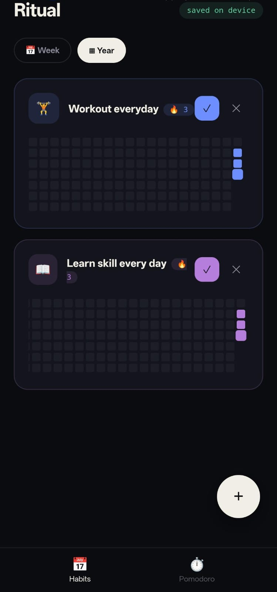
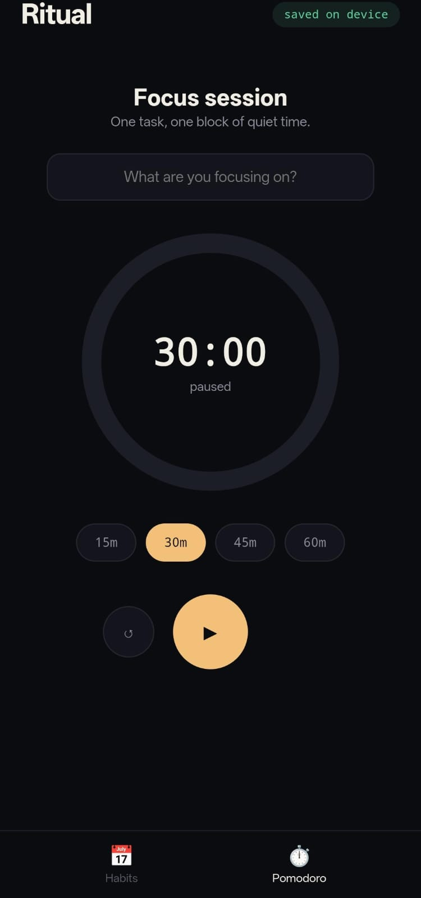

<p align="center">


</p>

## Overview

Ritual is a modern habit tracking application inspired by GitHub's contribution graph. It helps users create positive daily routines, maintain streaks, and visualize their progress through an intuitive and motivating interface.

The idea behind Ritual came from seeing GitHub's contribution graph. After discovering that similar apps with this type of visualization were paid, I decided to build my own habit tracker to create a simple, accessible, and motivating experience.

---

## Features

- ✅ Create and manage daily habits
- 📅 GitHub-inspired contribution graph
- 🔥 Habit streak tracking
- 📊 Visual progress monitoring
- 📱 Clean and responsive user interface
- ⚡ Fast and lightweight experience

---

## 📸 Screenshots

### 🏠 Home Screen


### 📅 Year View


### ➕ Add Habit


### ⏱️ Pomodoro


---

## Tech Stack

- HTML
- CSS
- JavaScript
- Capacitor
- Android

---

## Project Structure

```
RitualApp/
├── android/
├── assets/
├── icons/
├── www/
├── package.json
├── capacitor.config.ts
└── README.md
```

---

## Why I Built This

I wanted a habit tracker that uses GitHub's contribution graph to encourage consistency. Most similar apps I found required a paid subscription, so I built Ritual as a personal project to solve that problem while improving my software development skills.

---

## Future Roadmap

- Daily reminders
- Habit categories
- Statistics dashboard
- Monthly and yearly analytics
- Dark mode
- Cloud sync
- Backup & Restore
- Achievements and badges
- Widgets
- Data export

---

## Installation

```bash
git clone https://github.com/manishsingh0434-del/ritual-habit-tracker.git
cd ritual-habit-tracker
npm install
```

---

## Author

**Manish Singh**

Building software that helps people become more consistent every day.

---

## License

This project is currently for learning and personal development.
